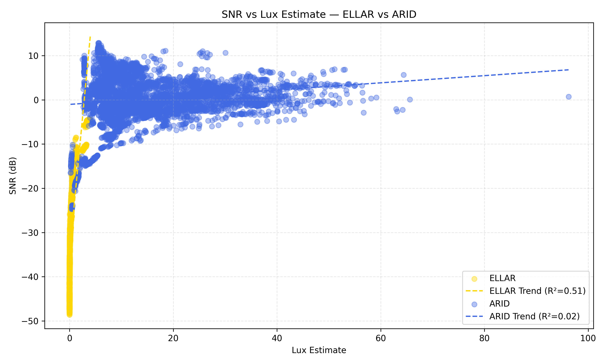
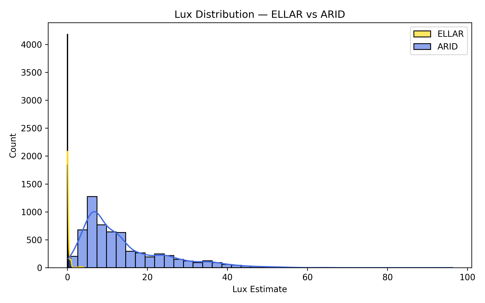
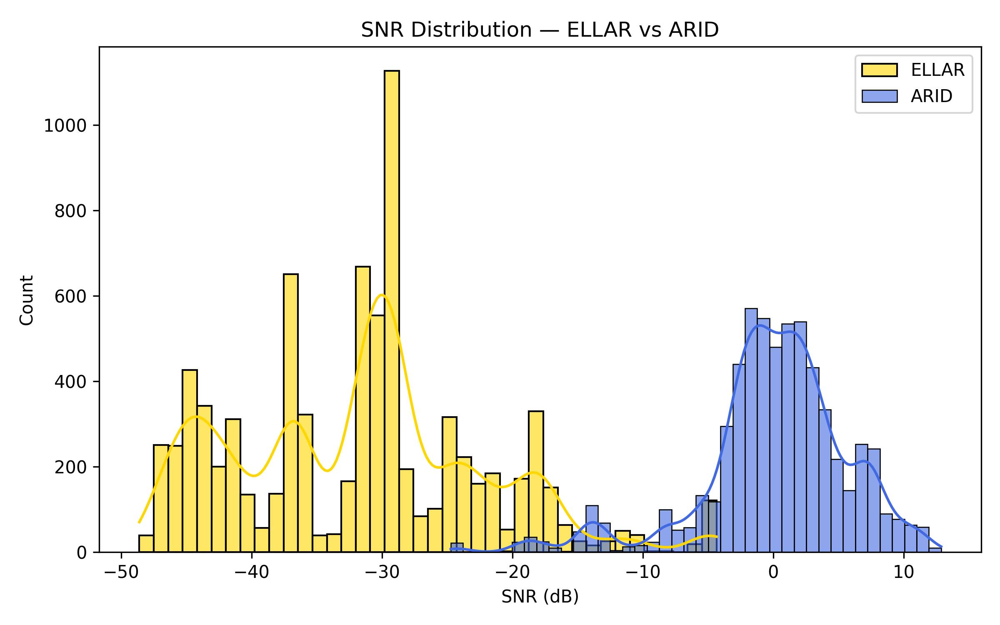
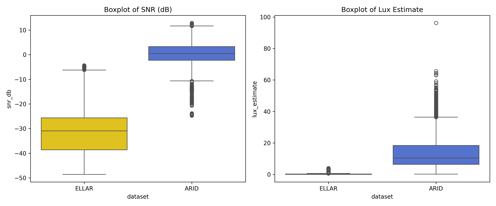

# 📊 ARID vs ELLAR Dataset Comparison: SNR & Lux Analysis

This project performs a visual and statistical comparison of two human activity video datasets — **ARID** and **ELLAR** — using two key frame-level metrics:

- **SNR (Signal-to-Noise Ratio)** – quantifies video quality
- **Lux Estimate** – approximates frame brightness

---

## 📁 Datasets Analyzed

### 🔹 ARID Dataset
- Human activity recognition dataset with clips across various indoor scenarios.
- Automatically scanned from subfolders like `Drink`, `Jump`, etc.

### 🔸 ELLAR Dataset
- Contains labeled videos like `Clapping`, `Dumping`, etc.
- Labels include: `ELLAR_label.txt`, `ELLAR_label_train.txt`, and `ELLAR_label_val.txt`.

---

## ⚙️ How It Works

The pipeline:

1. Loads video frames from each clip
2. Converts each frame to grayscale
3. Calculates:
   - **SNR (dB)**: `20 * log10(mean / std)`
   - **Lux Estimate**: mean grayscale pixel value
4. Stores results per video in CSV
5. Generates comparison plots

---

## 📈 Visualizations

### ▶️ 1. SNR vs Lux Scatter Plot with Trendlines

---

### ▶️ 2. Brightness (Lux) Histogram

---

### ▶️ 3. SNR (Noise) Histogram

---

### ▶️ 4. Boxplots for SNR and Lux

---

## 📂 Output CSVs

| File                    | Description                          |
|-------------------------|--------------------------------------|
| `arid_clip_snr_lux.csv` | SNR + Lux for each ARID video        |
| `ellar_snr_lux.csv`     | SNR + Lux + split/label for ELLAR    |

---

## 🛠 Scripts

| File                      | Description                                  |
|---------------------------|----------------------------------------------|
| `plot_all_ellar_arid.py`  | Generates all four comparison plots          |
| `ellar_snr_lux_all_splits.py` | Computes metrics for ELLAR dataset     |
| `snr_arid.py`             | Computes metrics for ARID dataset            |

---

## 🧠 Future Work

- Split-wise comparison (ELLAR train vs val)
- Per-class SNR/lux statistics
- Motion blur analysis
- Real-time clip quality filter

---

## 🤝 Contributing

Feel free to open issues or pull requests for improvements, feature requests, or additional metrics.

---

## 📜 License

This project is released under the MIT License.
